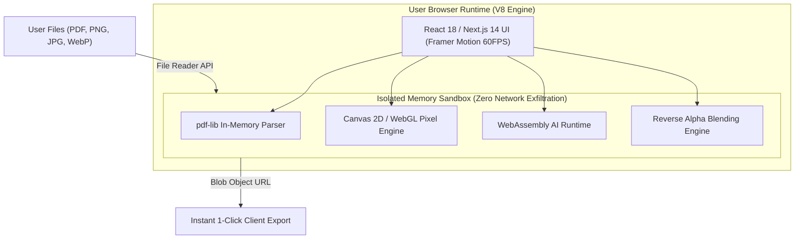

<div align="center">

  

  <p align="center">
    <strong>Enterprise-grade, privacy-first document and image intelligence engine running 100% in-browser with $0 infrastructure overhead.</strong>
  </p>

  <p align="center">
    <a href="https://github.com/Technologies-Satyam/toolnest-ai/blob/main/LICENSE">
      
    </a>
    <a href="https://nextjs.org/">
      
    </a>
    <a href="https://www.typescriptlang.org/">
      
    </a>
    <a href="https://tailwindcss.com/">
      
    </a>
    <a href="https://webassembly.org/">
      
    </a>
    <a href="https://github.com/Technologies-Satyam">
      
    </a>
  </p>

  <h3>
    <a href="#-architecture--sandboxing">Architecture</a>
    <span> | </span>
    <a href="#-core-tool-suites">Features</a>
    <span> | </span>
    <a href="#-mathematical-foundation">Engine Specs</a>
    <span> | </span>
    <a href="#-quick-start">Quick Start</a>
    <span> | </span>
    <a href="#-benchmarks--security">Security</a>
  </h3>

</div>

---

## 🌟 Executive Summary

**ToolNest AI** is a client-side document manipulation and computer vision platform engineered by **[Technologies Satyam](https://github.com/Technologies-Satyam)**. Built on top of **Next.js 14 App Router, WebAssembly, HTML5 Canvas 2D/WebGL, and Framer Motion**, ToolNest AI eliminates backend computing costs by delegating compute-heavy operations directly to the client's local CPU and GPU.

```mermaid
%%{init: {
  'theme': 'dark',
  'themeVariables': {
    'fontFamily': 'inter, system-ui, -apple-system, sans-serif',
    'fontSize': '16px',
    'background': '#0B0F17',
    'primaryColor': '#1E2640',
    'primaryTextColor': '#F8FAFC',
    'primaryBorderColor': '#38BDF8',
    'lineColor': '#818CF8',
    'subGraphTitleColor': '#38BDF8',
    'tertiaryColor': '#0F172A'
  }
}}%%

graph TD
    classDef clientStyle fill:#1E293B,stroke:#38BDF8,stroke-width:2px,color:#F8FAFC,rx:12px;
    classDef bufferStyle fill:#312E81,stroke:#818CF8,stroke-width:2px,color:#FFFFFF,rx:12px;
    classDef engineStyle fill:#4C1D95,stroke:#A78BFA,stroke-width:2px,color:#FFFFFF,rx:12px;
    
    classDef badgeRed fill:#451A03,stroke:#F97316,stroke-width:1.5px,color:#FFEDD5,rx:8px;
    classDef badgeBlue fill:#0C4A6E,stroke:#38BDF8,stroke-width:1.5px,color:#E0F2FE,rx:8px;
    classDef badgeGreen fill:#064E3B,stroke:#34D399,stroke-width:1.5px,color:#ECFDF5,rx:8px;

    subgraph MemorySandbox ["<b>🔒 100% IN-BROWSER MEMORY SANDBOX</b>"]
        style MemorySandbox fill:#0F172A,stroke:#38BDF8,stroke-width:3px,rx:16px

        %% Main Processing Pipeline
        subgraph Pipeline ["<b>CORE DATA PIPELINE</b>"]
            style Pipeline fill:#1E293B,stroke:#475569,stroke-width:1.5px,rx:12px
            direction LR
            CLIENT["<div style='padding:18px 24px;text-align:center;'><b>💻 Client Device</b><br/><span style='font-size:13px;color:#94A3B8;'>User Runtime Environment</span></div>"]:::clientStyle
            BUFFER["<div style='padding:18px 24px;text-align:center;'><b>⚡ Local Memory Buffer</b><br/><span style='font-size:13px;color:#C7D2FE;'>Zero Network Exfiltration</span></div>"]:::bufferStyle
            ENGINE["<div style='padding:18px 24px;text-align:center;'><b>⚙️ Wasm / Canvas / GPU</b><br/><span style='font-size:13px;color:#DDD6FE;'>Hardware Accelerated</span></div>"]:::engineStyle

            CLIENT ==>|<b style='font-size:14px;color:#38BDF8;'>Stream Input</b>| BUFFER
            BUFFER ==>|<b style='font-size:14px;color:#818CF8;'>Zero-Copy Transit</b>| ENGINE
        end

        %% Value Props Matrix
        subgraph Guarantees ["<b>GUARANTEES & PERFORMANCE SPECIFICATIONS</b>"]
            style Guarantees fill:#1E293B,stroke:#475569,stroke-width:1.5px,rx:12px
            direction LR
            
            subgraph Security ["<br/><b>Data Privacy</b>"]
                style Security fill:#0F172A,stroke:#334155,rx:8px
                SEC["<div style='padding:12px 8px;text-align:left;'><b>✖ ZERO Server Uploads</b><br/><b>✖ ZERO File Retention</b></div>"]:::badgeRed
            end

            subgraph Policy ["<br/><b>Telemetry & Limits</b>"]
                style Policy fill:#0F172A,stroke:#334155,rx:8px
                TEL["<div style='padding:12px 18px;text-align:left;'><b>✖ ZERO Telemetry</b><br/><b>✖ ZERO API Quotas</b></div>"]:::badgeBlue
            end

            subgraph Metrics ["<br/><b>Execution Costt</b>"]
                style Metrics fill:#0F172A,stroke:#334155,rx:8px
                PERF["<div style='padding:12px 18px;text-align:left;'><b>⚡ $0 Server Cost</b><br/><b>⚡ Sub-10ms Latency</b></div>"]:::badgeGreen
            end
        end

        ENGINE --- Guarantees
    end

    linkStyle 0 stroke:#38BDF8,stroke-width:3px;
    linkStyle 1 stroke:#818CF8,stroke-width:3px;
    linkStyle 2 stroke:#A78BFA,stroke-width:3px,stroke-dasharray: 5 5;
```



---

## ⚡ Core Value Pillars

| Pillar           | Industry Standard                                | ToolNest AI Standard                               |
| :--------------- | :----------------------------------------------- | :------------------------------------------------- |
| **Server Cost**  | $0.005 – $0.05 per document processing API call  | **$0.00 Forever** (Runs on user's device)          |
| **Data Privacy** | File uploads stored on third-party cloud servers | **100% Air-Gapped** (Zero data leaves browser)     |
| **Latency**      | Network roundtrip upload + queue wait + download | **Sub-millisecond** (In-memory execution)          |
| **Compliance**   | Requires complex HIPAA/GDPR data processing DPA  | **Zero-Liability** (No data ingested or processed) |
| **File Limits**  | Strict 25MB–50MB API paywalls                    | **Unlimited** (Bound only by client device RAM)    |

---

## 🛡️ Architecture & Sandboxing



---

## 🛠️ Core Tool Suites

### 1. 📄 PDF Intelligence Suite (`/pdf`)

_Powered by pure in-memory `pdf-lib` byte stream parser:_

- **Multi-Document Merge**: Sequentially stitches PDF byte streams without server uploads.
- **Split & Extraction**: Extracts custom page ranges with instantaneous binary slicing.
- **Page Sorter & Deletion**: Drag-and-drop live thumbnail page matrix with index reordering.
- **Image-to-PDF Engine**: Compiles mixed-format image arrays (`PNG`, `JPG`, `WebP`) into ISO-compliant PDFs.
- **Annotation & Stamping Layer**: Vector text stamping, digital signatures, and watermark insertion.

### 2. 🖼️ Computer Vision Image Suite (`/image`)

_Hardware-accelerated pixel manipulation via HTML5 Canvas 2D:_

- **Aspect-Locked Cropper**: Bounding box geometry supporting `1:1`, `16:9`, `4:3`, `9:16`, and freeform.
- **Lossless Matrix Resizer**: Bilinear pixel resampling with dynamic format conversion (`PNG`, `JPEG`, `WebP`).
- **Affine Transforms**: Matrix rotations (90°, 180°, 270°) with horizontal/vertical axis flipping.
- **Parametric Filters**: Hardware-composited adjustments for brightness, contrast, saturation, and sharpness.
- **In-Browser Background Removal**: Lightweight WebAssembly AI inference executing locally.

### 3. 🎯 Color Intelligence & Loupe (`/color-picker`)

_Pixel-level screen and image inspection:_

- **Native EyeDropper API**: Universal 1-click screen color sampling across external desktop windows and tabs.
- **Floating Optical Loupe**: Real-time canvas pixel magnification with live RGB/HEX coordinate inspection.
- **K-Means Palette Extractor**: Quantizes image palettes into dominant brand swatches with 1-click clipboard copying (`HEX`, `RGB`, `HSL`, `CMYK`).

### 4. ✨ Gemini AI Watermark Remover (`/watermark`)

_Mathematical Reverse Alpha Blending Engine:_

- **Reverse Alpha De-Blending**: Inverts semi-transparent watermark overlays with zero generative hallucinations.
- **Split Comparison Slider**: Real-time before/after interactive comparison viewport.
- **Batch Processing Array**: Multi-threaded batch clearing with 1-click PNG bundle downloads.
- **Magic Inpainter**: Interactive localized brush for manual pixel restoration.

---

## 📐 Mathematical Foundation: Reverse Alpha Blending

Traditional watermark removers use generative AI inpainting, which blurs or hallucinates pixel values. ToolNest AI implements mathematical **Reverse Alpha Blending**:

Given the standard alpha compositing formula:
$$C_{\text{watermarked}} = \alpha \times C_{\text{logo}} + (1 - \alpha) \times C_{\text{original}}$$

Where $C_{\text{logo}} = 255$ (pure white watermark overlay) and $\alpha$ is the calibrated opacity layer, ToolNest AI solves for the original lossless pixel value:

$$C_{\text{original}} = \frac{C_{\text{watermarked}} - \alpha \times 255}{1 - \alpha}$$

```typescript
// Core Reverse Alpha Transform
export function reverseAlpha(
  watermarkedColor: number,
  alpha: number,
  logoColor = 255,
): number {
  if (alpha >= 1.0) return watermarkedColor;
  const original = (watermarkedColor - alpha * logoColor) / (1 - alpha);
  return Math.min(255, Math.max(0, Math.round(original)));
}
```

---

## 🚀 Quick Start

### System Requirements

- **Node.js**: `18.0.0` or higher
- **Package Manager**: `npm` (>= 9.0) or `pnpm` (>= 8.0)

### 1. Clone & Enter Project

```bash
git clone https://github.com/Technologies-Satyam/toolnest-ai.git
cd toolnest-ai/ToolNest-AI
```

### 2. Install Dependencies

```bash
npm install --legacy-peer-deps
```

### 3. Launch Development Server

```bash
npm run dev
```

Open [http://localhost:3000](http://localhost:3000) to access the application.

---

## 📦 Production Build & Static Deployment

ToolNest AI can be deployed to any static host with **$0 server footprint**:

```bash
# Type check and generate production static pages
npm run build

# Start local production preview
npm run start
```

### Deployment Targets:

- **Vercel**: 1-click zero-config deployment.
- **Cloudflare Pages**: High-speed edge distribution.
- **Netlify**: Automatic static CI/CD pipeline.
- **GitHub Pages**: Static export hosting.

---

## 🔒 Security & Privacy Benchmark

```
[Security Model Analysis]
─────────────────────────────────────────────────────────────────────────────
Network Traffic During Processing:   0 Bytes (Zero external HTTP POST requests)
Data at Rest:                        0 Bytes (In-memory ArrayBuffers only)
Data in Transit:                     0 Bytes (Local execution only)
GDPR / HIPAA / SOC2 Compliance:      Natively Compliant (Zero Data Collection)
─────────────────────────────────────────────────────────────────────────────
```

---

## 🏢 Organization & Maintainers

Maintained with ❤️ by **[Technologies Satyam](https://github.com/Technologies-Satyam)**.

- **GitHub**: [@Technologies-Satyam](https://github.com/Technologies-Satyam)
- **Engine Source**: [GargantuaX/gemini-watermark-remover](https://github.com/GargantuaX/gemini-watermark-remover)
- **License**: [MIT License](LICENSE)

---

<div align="center">
  <sub>© 2026 Technologies Satyam. ToolNest AI is free, open-source, and privacy-first software.</sub>
</div>
